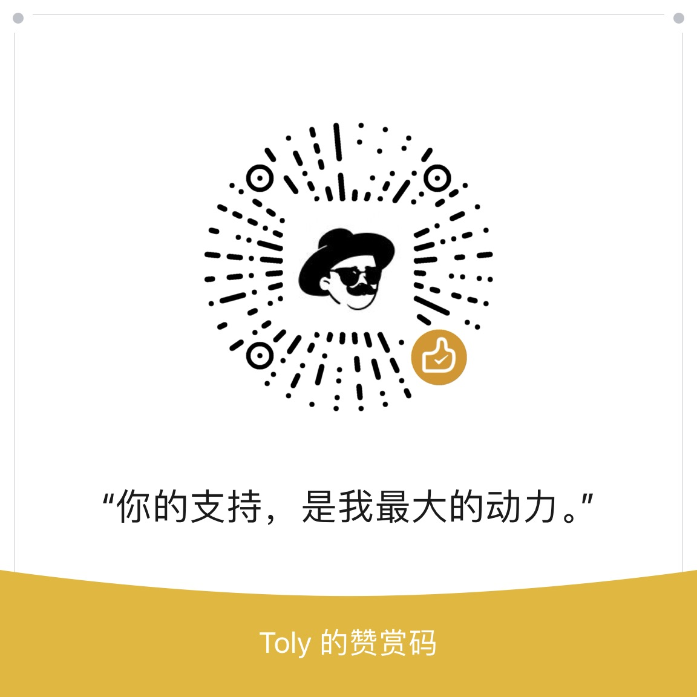

# CS Reading

[欢迎访问网站](http://csreading.cn)下载书籍。

[英语学习请查看这里](https://stylishreader.com)

您的扫码支持，我将倍感荣幸。

_如需在**赞助者列表**中显示您的个人链接，请在"赞助备注"中填写您的Github ID或联系方式_

| 赞助者                               | 个人网站     |
| ----------------------------------- | ------- |
| **psychopath**                     | 暂未提供 |
| **ttsy**                     | 暂未提供 |
| **清风徐来**                     | 暂未提供 |
| **微博收割者**                     | 暂未提供 |
| **yulu**                     | [Github](https://github.com/yulu) |

如需在赞助者列表中显示您的个人链接，请在"赞助备注"中填写您的Github ID。

不知不觉，仓库已经存在十多年，前段时间凑巧看到几篇博文的推荐，心想对仓库进行下整理，希望能够帮助到更多在求索之路上的伙伴。

如果有想看的书，可以[提交Issue](https://github.com/tolerious/Programming_learning_resource/issues/new)

也欢迎刚入行的计算机新人咨询关于计算机编程学习，职业规划等问题。
